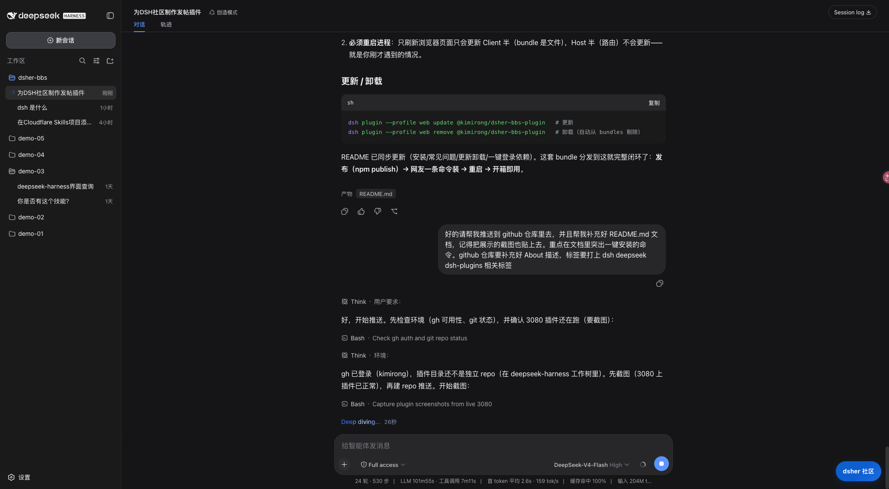
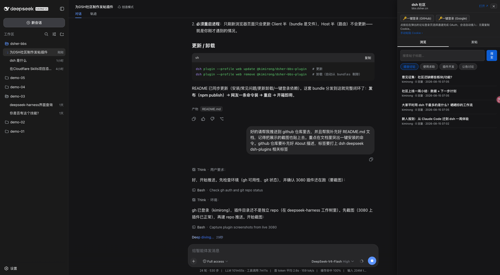
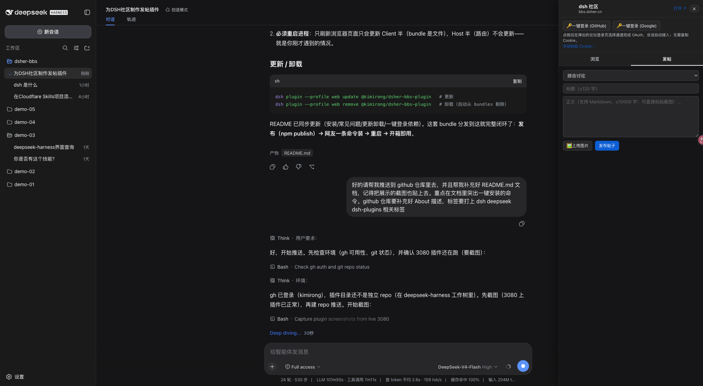

# dsher-bbs-plugin

在 DeepSeek Harness Web UI 中集成 [bbs.dsher.cn](https://bbs.dsher.cn)（dsh 社区）的**正式 bundle 插件**：右下角悬浮入口，浏览 / 搜索 / 发帖 / 回帖 / 点赞 / 粘贴截图上传 / 一键登录，开箱即用。

## ✨ 一键安装

> 前提：机器上已安装 [DeepSeek Harness](https://github.com/deepseek-ai/deepseek-harness)（带 `dsh` 命令），并已跑过 `dsh web`。

```sh
# ① 一条命令装进 web profile（自动加入 profile bundles）
dsh plugin --profile web add @kimirong/dsher-bbs-plugin

# ② 完全重启 dsh web 进程（不是刷新页面！）
dsh web
```

重启后，页面**右下角**出现「dsher 社区」蓝色胶囊按钮，点击即可浏览 / 发帖 / 回帖 / 点赞 / 上传图片 / 一键登录。

### 安装遇到 `ERR_PNPM_ADDING_TO_ROOT`？

pnpm 8+ 对 workspace 根 `add` 有校验，`dsh plugin` 可能因此失败。一行配置解决：

```sh
echo 'ignore-workspace-root-check=true' >> ~/.dsh/profiles/web/.npmrc
dsh plugin --profile web add @kimirong/dsher-bbs-plugin
```

### 更新 / 卸载

```sh
dsh plugin --profile web update @kimirong/dsher-bbs-plugin   # 更新到新版本
dsh plugin --profile web remove @kimirong/dsher-bbs-plugin   # 卸载（自动从 bundles 剔除）
```

## 截图

右下角悬浮入口 | 面板 · 浏览 | 面板 · 发帖
--- | --- | ---
 |  | 

## 功能特性

- **右下角悬浮入口**：品牌蓝胶囊按钮常驻页面右下角，不占用侧栏空间，随时点开
- **浏览 / 搜索**：版块分类 → 帖子列表（分页）→ 详情（正文 / 回复），搜索框直接集成在浏览页顶部
- **发帖 / 回帖 / 点赞**：面板内完成，支持 Markdown
- **粘贴截图 / 图片上传**：正文与回复框直接粘贴截图（自动转码上传）或点「🖼 上传图片」
- **一键登录**：弹窗走论坛同款 GitHub / Google OAuth，会话自动接入，无需复制 Cookie（手动粘贴仅作备用）

## 架构

| 部分 | 文件 | 说明 |
| --- | --- | --- |
| Host 半 | `src/host/index.ts` | 注册 `ctx.webServer` 路由 `/api/dsher-bbs/*`，把论坛能力暴露为本机 JSON RPC |
| Host 逻辑 | `src/host/forum.ts` | 论坛访问（Node 全局 fetch）+ HTML 正则解析 |
| Client 半 | `src/client/index.ts` | `dsh.client` 插件入口，`ctx.inject(['slots'], ...)` 注册 `shell.overlay` 槽位 |
| Client UI | `src/client/Panel.tsx` | 悬浮按钮 + 面板（React），同源 `fetch('/api/dsher-bbs/<method>')` 调 Host |
| Client RPC | `src/client/rpc.ts` | fetch 封装 |

**为什么不走 Typert @Remote**：`@deepseek-ai/dsh-api-remotes` 的客户端装配是静态白名单（只 import 官方包的 `/remote`），第三方独立包的 remote 不会被自动挂载。因此本包用**自建 HTTP 路由**：Host 半注册 webserver 前缀路由，Client 半同源 fetch——这是独立 bundle 插件的通用可交付模式。

**实现差异（与动态插件版 `dsh-bbs-plugin/` 对比）**：

| | 动态插件版 | 本包（bundle） |
| --- | --- | --- |
| Host 网络 | `ctx.shell` + curl（沙箱无 fetch） | 普通 Node 全局 `fetch` / `FormData` / `Blob` / `Buffer` |
| RPC | `harness.handle` / `host.call`（动态运行器专属） | `ctx.webServer` 路由 / 浏览器 fetch |
| 安装 | Agent `cordis_define` + `cordis_run`（会话级） | `dsh plugin --profile web add <pkg>`（机器级） |
| 生效 | 会话内存，重启即失 | profile 常驻，重启 `dsh web` 后装载 |

## 开发与构建

```sh
npm install
npm run build      # tsdown → lib/index.mjs（Host ESM）+ lib/client.js（浏览器 CJS bundle）
npm run typecheck  # 类型检查
```

产物约定（与官方 client 包一致）：

- `lib/index.mjs` — Host 半，Loader 按包名解析
- `lib/client.js` — 浏览器 bundle，`window.__ModuleLoader__.load({ id, factory })` 闭包工厂格式，由 `@deepseek-ai/dsh-client-modules` 的 `/plugins/<id>/client.js` 路由提供给浏览器
- `package.json` 的 `dsh.bundle.patch` 声明本包是一层 profile patch；`dsh.client` 声明浏览器半

## 发布

```sh
npm publish --access public
```

发布前检查：`files` 只含 `lib/` 与 `cordis.patch.yml`；`exports` 暴露 `.`（Host）与 `./client`（浏览器半）。

## 一键登录（需要论坛侧配合）

会话 Cookie 是 httpOnly，浏览器脚本读不到，「一键登录」依赖论坛的桥接页 `/dsh-login`（`src/routes/dsh-login.tsx`，本论坛已部署）：

1. 面板点「🔑 一键登录」→ 弹窗打开 `https://bbs.dsher.cn/dsh-login?origin=<DSH UI 来源>`；
2. 未登录时该页渲染站内同款登录按钮，点击走 Better Auth OAuth；
3. 已登录时由服务端读取会话 Cookie，经 `window.opener.postMessage` 交还插件弹窗并自动关闭；
4. 插件收到后自动验证并显示登录用户。

安全边界：`/dsh-login` 只接受 `localhost` / `127.0.0.1` 来源，Cookie 绝不发往公网来源。

> 自建论坛需同步部署 `src/routes/dsh-login.tsx` 并重新部署；未部署时可用「手动粘贴 Cookie」备用方式。

## 限制与说明

- 论坛是 Hono + htmx 服务端渲染，无公开 JSON API；`forum.ts` 的解析正则与当前版块 HTML 结构一一对应，论坛改版后需同步更新。
- 写操作受论坛限流：5 帖/小时、30 回帖/小时、60 点赞/小时、20 上传/小时。
- `/api/dsher-bbs` 路由无鉴权（与 DSH 页面同源同权限）：任何能访问该 DSH 页面的人都能调用；会话 Cookie 只存在 Host 进程内存，不落盘、不外发。
- 论坛正文用 `marked` 渲染且未 sanitize，`forum.ts` 对正文做了基础净化，但渲染第三方内容仍有风险。

## 许可证

MIT（见 [LICENSE](LICENSE)）。
